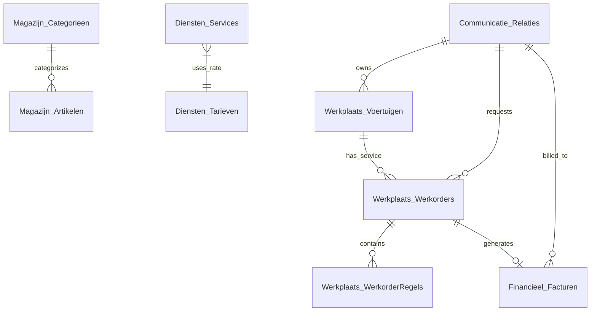

# WinCar Database Schema Documentation

This document details the database structure for GarageAI's integration with the WinCar DMS (Dealer Management System).

## Overview

The database is built on **Microsoft SQL Server** (Azure SQL Edge in development) and consists of 9 relational tables organized into 5 functional modules.

### Modules
1.  **COMMUNICATIE (CRM)**: Customer management.
2.  **WERKPLAATS (Workshop)**: Vehicles, work orders, and service lines.
3.  **MAGAZIJN (Warehouse)**: Parts inventory and categories.
4.  **DIENSTEN (Services)**: Standard service pricing and labor rates.
5.  **FINANCIEEL (Finance)**: Invoicing and payments.

---

## Entity Relationship Diagram (ERD)

*(Note: `Diensten_Services` logic uses `Diensten_Tarieven` for calculation but doesn't have a strict FK constraint in this schema version.)*

---

## Table Details

### 1. COMMUNICATIE (CRM)

#### `Communicatie_Relaties`
Stores customer information.

| Column | Type | Description |
| :--- | :--- | :--- |
| **`KlantID`** | `INT` (PK) | Unique Customer ID (Identity). |
| `KlantNaam` | `NVARCHAR(100)` | Full Name. |
| `Telefoon` | `NVARCHAR(20)` | Normalized phone number. |
| `Email` | `NVARCHAR(100)` | Email address. |
| `Adres` | `NVARCHAR(200)` | Street and number. |
| `Woonplaats` | `NVARCHAR(100)` | City. |
| `AanmaakDatum` | `DATETIME` | Date customer was added. |

---

### 2. WERKPLAATS (Workshop)

#### `Werkplaats_Voertuigen`
Stores vehicle information.

| Column | Type | Description |
| :--- | :--- | :--- |
| **`VoertuigID`** | `INT` (PK) | Unique Vehicle ID. |
| `Kenteken` | `NVARCHAR(20)` | License Plate (Unique). |
| `Merk` | `NVARCHAR(50)` | Brand (e.g., VW, Tesla). |
| `Model` | `NVARCHAR(50)` | Model (e.g., Golf, Model 3). |
| `KlantID` | `INT` (FK) | Owner (Links to `Communicatie_Relaties`). |
| `Bouwjaar` | `INT` | Year of manufacture. |
| `Brandstof` | `NVARCHAR(20)` | Fuel type (Benzine, Diesel, etc). |
| `KilometerStand`| `INT` | Last known mileage. |
| `LaatsteAPK` | `DATE` | Date of last APK check. |

#### `Werkplaats_Werkorders`
The core transactional table for service appointments and repairs.

| Column | Type | Description |
| :--- | :--- | :--- |
| **`WerkorderID`** | `INT` (PK) | Work Order # (Starts at 2024001). |
| `VoertuigID` | `INT` (FK) | Vehicle being serviced. |
| `KlantID` | `INT` (FK) | Customer requesting service. |
| `Status` | `NVARCHAR(50)` | `Gepland`, `In Behandeling`, `Klaar`, etc. |
| `Omschrijving` | `NVARCHAR(MAX)` | Description of the problem/request. |
| `GeplandeDatum` | `DATETIME` | Appointment date/time. |
| `Monteur` | `NVARCHAR(50)` | Assigned mechanic name. |

#### `Werkplaats_WerkorderRegels`
Line items for a work order (specific parts or labor tasks).

| Column | Type | Description |
| :--- | :--- | :--- |
| **`RegelID`** | `INT` (PK) | Unique Line ID. |
| `WerkorderID` | `INT` (FK) | Parent Work Order. |
| `Type` | `NVARCHAR(20)` | `ARBEID` (Labor) or `ONDERDEEL` (Part). |
| `Omschrijving` | `NVARCHAR(200)` | Detail (e.g., "Oil Filter", "Replace Brake"). |
| `Aantal` | `DECIMAL(10,2)` | Quantity or Hours. |
| `PrijsPerEenheid`| `DECIMAL(10,2)` | Unit price. |

---

### 3. MAGAZIJN (Warehouse)

#### `Magazijn_Artikelen`
Parts inventory.

| Column | Type | Description |
| :--- | :--- | :--- |
| **`ArtikelID`** | `INT` (PK) | Internal ID. |
| `ArtikelCode` | `NVARCHAR(50)` | SKU / Part Number (Unique). |
| `Omschrijving` | `NVARCHAR(200)` | Name of the part. |
| `CategorieID` | `INT` (FK) | Links to `Magazijn_Categorieen`. |
| `Inkoopprijs` | `DECIMAL(10,2)` | Cost price. |
| `Verkoopprijs` | `DECIMAL(10,2)` | Selling price (Excl. VAT). |
| `VoorraadAantal`| `INT` | Current stock level. |
| `Locatie` | `NVARCHAR(50)` | Warehouse bin location (e.g., A-01-02). |

#### `Magazijn_Categorieen`
Categories for parts.

| Column | Type | Description |
| :--- | :--- | :--- |
| **`CategorieID`** | `INT` (PK) | Category ID. |
| `Naam` | `NVARCHAR(50)` | e.g., 'Remmen', 'Filters', 'Banden'. |

---

### 4. DIENSTEN (Services)

#### `Diensten_Services`
Catalog of standard services (Menu Pricing).

| Column | Type | Description |
| :--- | :--- | :--- |
| **`ServiceID`** | `INT` (PK) | Service ID. |
| `ServiceCode` | `NVARCHAR(20)` | e.g., 'APK', 'BEURT-G'. |
| `Naam` | `NVARCHAR(100)` | Customer-facing name. |
| `StandaardPrijs`| `DECIMAL(10,2)` | Base price for the service package. |
| `ArbeidUren` | `DECIMAL(4,2)` | Estimated labor hours (for calculation). |

#### `Diensten_Tarieven`
Hourly labor rates.

| Column | Type | Description |
| :--- | :--- | :--- |
| **`TariefID`** | `INT` (PK) | Rate ID. |
| `Naam` | `NVARCHAR(50)` | e.g., 'Standaard', 'Specialist'. |
| `UurTarief` | `DECIMAL(10,2)` | Price per hour. |

---

### 5. FINANCIEEL (Finance)

#### `Financieel_Facturen`
Invoices generated from completed work orders.

| Column | Type | Description |
| :--- | :--- | :--- |
| **`FactuurID`** | `INT` (PK) | Invoice # (Starts at 20240001). |
| `WerkorderID` | `INT` (FK) | Links to completed Work Order. |
| `KlantID` | `INT` (FK) | Billed Customer. |
| `TotaalBedrag` | `DECIMAL(10,2)` | Total amount (Incl. VAT). |
| `BetaalStatus` | `NVARCHAR(50)` | `Openstaand`, `Betaald`. |
| `BetaalLink` | `NVARCHAR(200)` | iDeal payment URL. |

---

## Key Design Decisions

1.  **Identity Columns**: All Primary Keys use `IDENTITY(1,1)` (auto-increment) for simplicity.
2.  **Dutch Naming**: Table and column names use Dutch conventions to match the domain language (and typical WinCar naming).
3.  **Loose Coupling**: Some relationships (like Services to Rates) are logical rather than strictly enforced by FKs to allow flexibility in the mock environment.
4.  **Optimized for AI**: Text fields like `Omschrijving` are intentionally verbose to provide context to the LLM when it queries the database.
