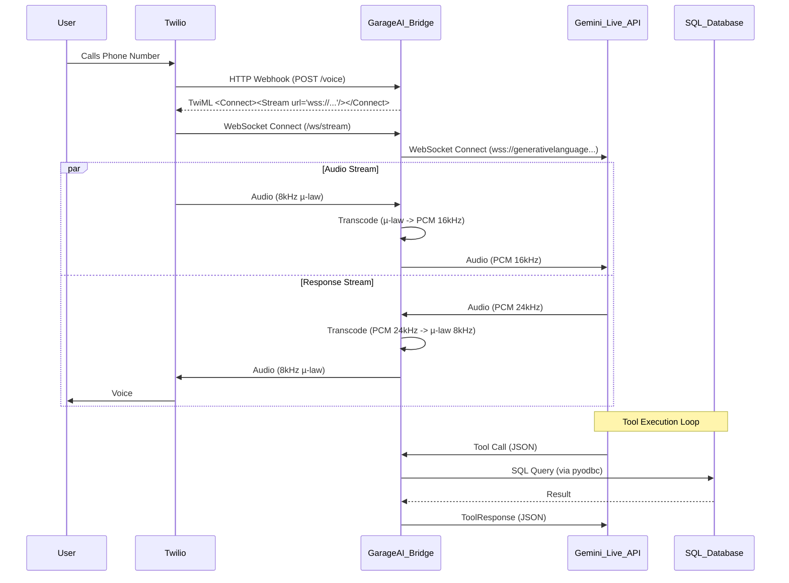

# GarageAI Architecture Documentation

## 1. System Overview
GarageAI Integration is a low-latency, voice-enabled assistant for Dutch automotive garages using **WinCar DMS**. The system acts as a **Telephony Bridge**, connecting incoming phone calls (via Twilio) directly to Google's **Gemini Multimodal Live API**.

**Core Goal**: Provide a conversational AI that answers in <800ms, speaks native Dutch, and executes read-only/safe-write operations on the WinCar database.

## 2. Architecture: The "Telephony Bridge"
This architecture replaces the previous Polling/Vapi approach with a direct streaming connection to minimize latency.



### 2.1 Audio Processing (Resampling)
Direct transcoding is required between telephony standards and AI model standards.

**Inbound (Twilio -> Gemini)**
- **Input**: G.711 µ-law, 8000 Hz, Mono.
- **Process**: 
    1. Decode µ-law to Linear PCM (16-bit).
    2. Upsample from 8000 Hz to 16000 Hz (Gemini requirement).
- **Target**: Linear PCM, 16000 Hz, 16-bit, Little Endian.

**Outbound (Gemini -> Twilio)**
- **Input**: Linear PCM, 24000 Hz (Gemini default).
- **Process**:
    1. Downsample from 24000 Hz to 8000 Hz.
    2. Encode Linear PCM to G.711 µ-law.
- **Target**: G.711 µ-law, 8000 Hz.

### 2.2 WebSocket Handshake Flow
1. **Connection**: Twilio connects to `/ws/stream`.
2. **Start Event**: Twilio sends a `start` event containing the `streamSid`.
3. **Gemini Session**: Server initializes a Gemini Session via `BidiGenerateContent`.
    - **Config**: Sets `response_modalities=["AUDIO"]`, `language="nl-NL"`.
    - **System Instruction**: Sends the persona and rules.
    - **Tools**: Sends functionality definitions (Function Declarations).
4. **Media Events**: server listens for `media` events from Twilio and `server_content` chunks from Gemini.

## 3. Data Dictionary & Function Calling Schemas
The AI interacts with the world via **Function Calling**. These schemas are defined using Pydantic.

### 3.1 Appointment Booking (`BookAppointment`)
Used when a user explicitly agrees to a date and time for service.

```python
class BookAppointment(BaseModel):
    """
    Books a confirmed appointment in the WinCar workshop schedule.
    Use this ONLY when the user has explicitly agreed to a proposed time.
    """
    customer_phone: str = Field(..., description="The caller's phone number as identified or provided.")
    license_plate: str = Field(..., description="The vehicle license plate (Kenteken), formatted without dashes if possible.")
    service_type: str = Field(..., description="Type of service: 'APK', 'Grote Beurt', 'Kleine Beurt', 'Reparatie', or 'Diagnose'.")
    date_time: str = Field(..., description="ISO 8601 formatted datetime string (YYYY-MM-DDTHH:MM:SS) for the appointment start.")
    description: str = Field(..., description="Short description of the issue or request (Dutch).")
```

### 3.2 Customer Identification (`IdentifyCustomer`)
Used at the start of the call to retrieve context.

```python
class IdentifyCustomer(BaseModel):
    """
    Look up customer details by phone number to personalize the greeting.
    """
    phone_number: str = Field(..., description="The incoming caller ID or stated phone number.")
```

### 3.3 Stock Check (`CheckStock`)
Used to answer "Do you have this part?" or "How much is X?".

```python
class CheckStock(BaseModel):
    """
    Queries the 'Magazijn' module for part availability and pricing.
    """
    part_name: str = Field(..., description="Fuzzy name of the part (e.g., 'remschijven golf 7').")
    vehicle_model: str = Field(None, description="Optional vehicle context if known.")
```

## 4. Safety & Security
- **Read-Only**: `CheckStock`, `IdentifyCustomer` run on a read-only SQL cursor.
- **Write**: `BookAppointment` writes to `Werkplaats_Werkorders`.
    - *Constraint*: Must not overwrite existing slots without checking availability (handled by SQL logic).
- **Interrupts**: If the user interrupts (speaks while AI is talking), the bridge must capture the `interruption` event and send a `clear_buffer` signal to Twilio to stop playback immediately.

## 5. Deployment
- **Environment**: Dockerized Python 3.11+.
- **Dependencies**: `fastapi`, `uvicorn`, `websockets`, `google-genai`, `numpy` (for resampling), `twilio`.
